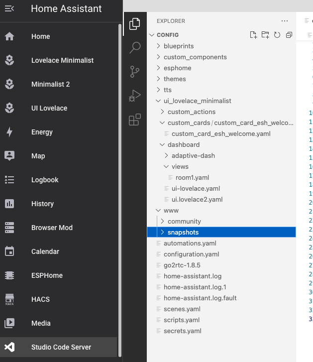

<!--

<!-- PROJECT LOGO -->
 

  
  <h3 align="center">Home Assistant with Google Generative AIl</h3>

When motion is detected on CCTV camera, Google Generative AI sends descitption of the snapshot to your phone

    

This is a quick guide your Home Assistant to take a snapshot when motion is detected on your IP Camera, have Google Generative AI Conversation integration to describe the snapshot, and send a notification with the snapshot and description.

# Requirements: 
1. Add your phone to HA by installing the app on your device and logging in.
2. Your cameras need to be added in HA, they will need to support motion detection and HA must have an entity to be able to see that motion alarm status.

# Getting Started
1. Install the integration from here: https://www.home-assistant.io/integrations/google_generative_ai_conversation/
2. Create a directory under your www folder called "snapshots"

    

3. Ensure your camera has motion detection turned on and that HA can see the alarm when motion is detected.

4. Create a AUTOMATION named: "Driveway - Snapshot on motion" using the following code: [ai_notifications_automation](https://github.com/ljgoe/HomeAssistant-google_ai/blob/main/ai_notifications_automation) Note that switching to visual editor will help you find your camera and entity id's. This automation will run the script (created in the next step) when HA receives the motion alarm from your camera. Choose Edit in Yaml in the top right corner

    
      

5. Create a SCRIPT called: "Driveway - Snapshot, AI & Notification" with the following code: https://github.com/ljgoe/HomeAssistant-google_ai/blob/main/ai_notification_script This script takes the snapshot, gets Google AI to describe it and then send you the notification with what the AI sees and with snapshot image attached. You can run this manually to test. :)

    

You should now get a notification describing the image when your camera detects motion and HA takes the snapshot. Hopefully it gives you an idea how to do, you can edit the scripts prompt part to give you better answers and you can duplicate these automations and scripts for as many cameras as you like. Fi

This one takes 3 snapshots 0.5 seconds apart, sends those 3 images google to compare and if google notices no significant motion, the notification WILL NOT get sent.

This hopefully cuts down on false notifications or ones from trees ect moving! It also helps the AI notice actual movement of things like cars... BE AWARE: If you change the google prompt, especially the "If you see no obvious causes of motion, reply with "Camera has detected motion however no obvious motion observed comparing snapshots". part, you will also have to change the IF statement part to suit.

ALSO NOTE: this sends 3 images to google, so if you get a "Error generating content: 400 Request payload size exceeds the limit" error, if you manually run the script, your camera snapshots are too big, and you have to adjust it back to 2 images by removing the last snapshot action, the 0.5 second delay before it and then removing the reference to the 3rd image from under image_filename in the google ai service part....
